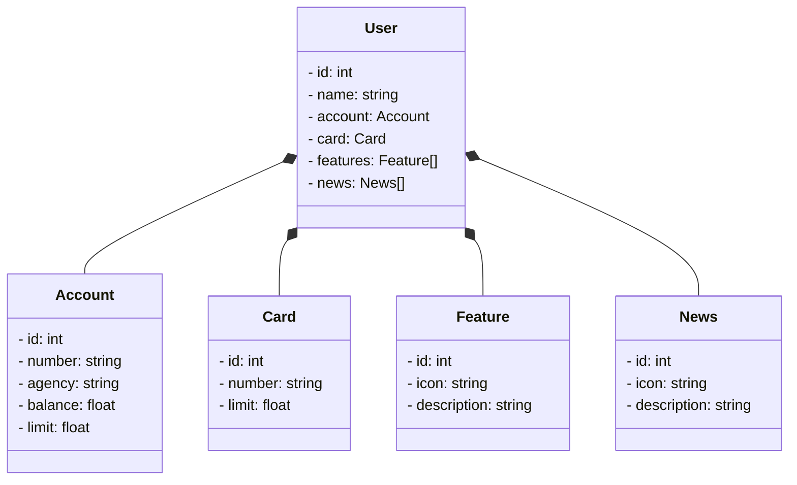

# Santander Dev Week
Java RESTful API para Santander Dev Week

## Diagrama de classes

```mermaid
classDiagram
  class User {
    - id: int
    - name: string
    - account: Account
    - card: Card
    - features: Feature[]
    - news: News[]
  }

  class Account {
    - id: int
    - number: string
    - agency: string
    - balance: float
    - limit: float
  }

  class Card {
    - id: int
    - number: string
    - limit: float
  }

  class Feature {
    - id: int
    - icon: string
    - description: string
  }

  class News {
    - id: int
    - icon: string
    - description: string
  }

  User *-- Account
  User *-- Card
  User *-- Feature
  User *-- News
```
